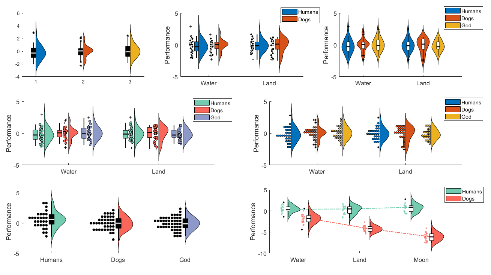
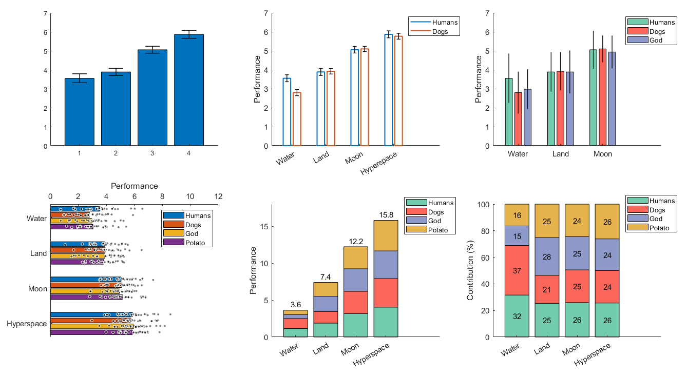

# DataViz

Some data visualization functions for Matlab.

## Functions for visualizing 2-level factorial data (conditions x groups)

**_daviolinplot_**, **_daboxplot_**, and **_dabarplot_** are lightweight plotting functions designed to address the limitations of Matlab's built-in tools and to encourage good data visualization practices (highlighting features of the the data that are important for both interpreting the effects and spotting possible issues with the data). 

All three functions: 
- Are created for 2-level factorial data but also work with one-factor data
- Can handle different input types (cell or numeric arrays)
- Are easily customizable for emphasizing data features and maximizing reliability
- Export many handles for furher optimization
- Go hand in hand with 2-way (mixed) ANOVA analysis

## daviolinplot.m 

**_daviolinplot_** is the best option for highlighitng data distribution properties. It combines boxplots, kernel density, and data scatter to produce different hybrids of violin plots, half-violin plots, raincloud plots, and dotplots. Kernel density highlights the overall shape of the data distribution which is relevant for noticing violations of the normality assumption. Dotplots are similar in that regard but additionally they convey the exact number of datapoints across the distribution. 

Note: dotplots usually require some tweaking to make them look presentable. You may have to play around with bin number ('_bins_') and marker size ('_scattersize_') to make it look right.

The examples below illustrate most of the functionality and options (see _daviolinplot_demo.m_ for the code).

## daboxplot.m

**_daboxplot_** is the second best option for highlighting data distribution properties. It mainly does this via different options for combining boxplots with jittered data as well as indicating means and medians on the boxplots to reveal skewness. It is also offers many options when it comes to stylistic aspects of the plots.

The examples below illustrate most of the functionality and options (see _daboxplot_demo.m_ for the code).

The below examples illustrate more recently added options:
- Indicate means on each box (to show skewness)
- Link the boxes within each group (to emphasize interaction effects)
- Link datapoints across conditions (to emphasize within-individual effects)

## dabarplot.m

**_dabarplot_** is the worst option for highlighting data distribution properties. However, it still encourages to add error bars (you can choose between standard error, within-subject error, or standard deviation) and allows jittered data. Overall, it is best suited for situations where visualizing data distribution is not as important, when the emphasis is not on hypothesis testing and statistical significance but on the effect size. Using stacked bars and adding number values on top of them can be particularly effective in conveying effect sizes among conditions or among groups.  

The examples below illustrate most of the functionality and options (see _dabarplot_demo.m_ for the code).

