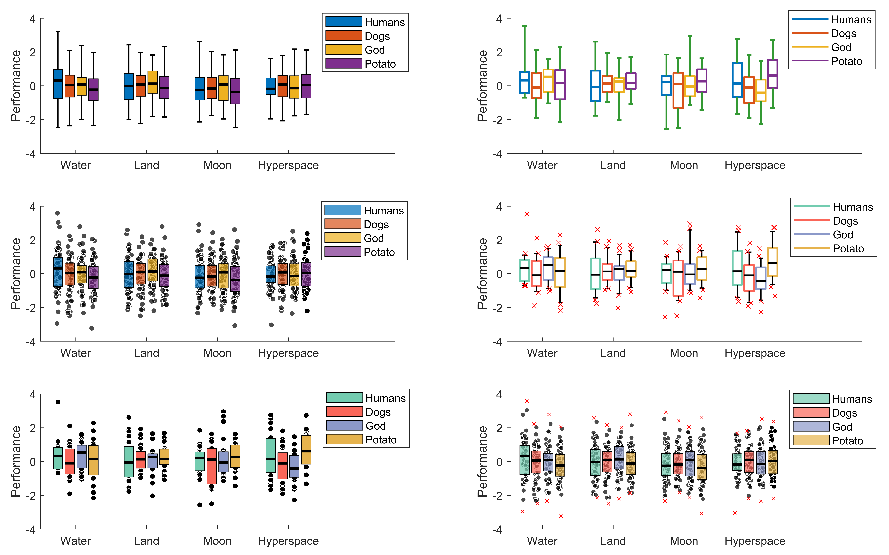

# DataViz
Data visualization functions for Matlab

# daboxplot.m

A lightweight function for visualizing 2-level factorial data (conditions x groups) using boxplots - something that the built-in Matlab boxplot function cannot do. Goes hand in hand with two-way ANOVA tests. 

- Created for 2-level factorial data, but also works with one-factor data
- Easily customizable for emphasizing data features and maximizing readability
  - spacing, scaling, transparency, scatter, outlier, mean, linking line options
- Can handle different input types (cell or numeric array) 
- Exports many handles for further customization
- Fairly neat

The examples below illustrate most of the functionality and options (see daboxplot_demo.m for the code).

The below examples illustrate more recently added options:
- Indicate means on each box (to show skewness)
- Link the boxes within each group (to emphasize interaction effects)

